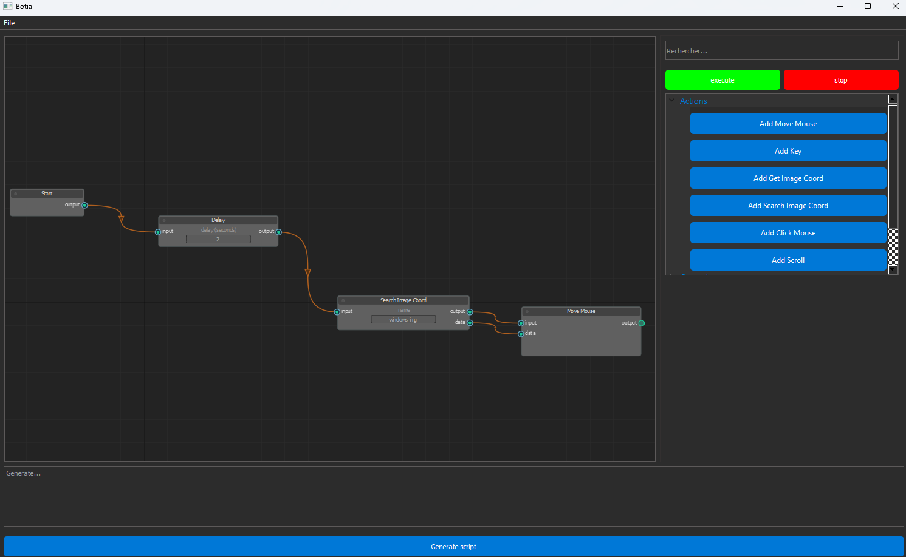

# Botia

Create a script to automate tasks using image recognition.

# Installation

git clone https://github.com/leteemo/Botia.git \
cd Botia \
python setup install \
python src/botia.py

# Example of script

