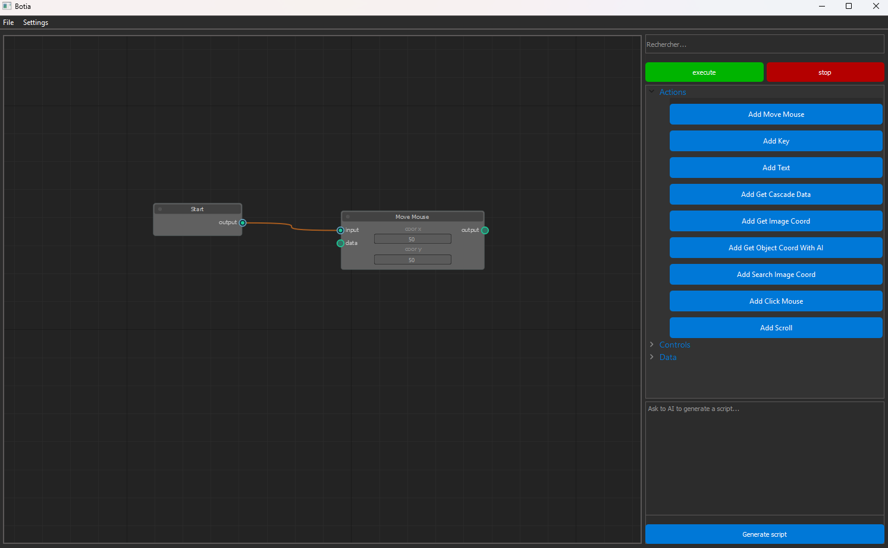
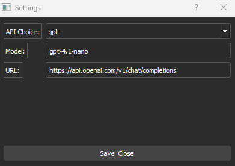
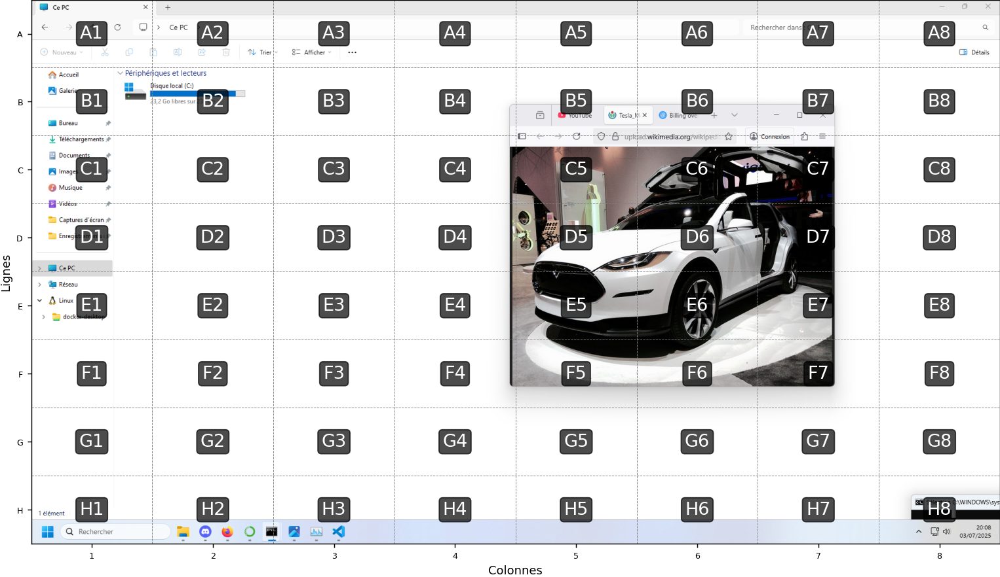

# Botia

Create a script to automate tasks using image recognition.

# Installation

git clone https://github.com/leteemo/Botia.git \
cd Botia \
python setup install \
python src/botia.py

# Start a script

You can choose the type of node you want (action, controll, data) and connect it to the node Start. \
For example you can add the node Move Mouse to move it to x=100 and y=100.

# How to configure the LLM API

Go to Settings -> Open Settings.
Enter the endpoint URL and the model.
If you need an API key for GPT, set the environment variable OPENAI_API_KEY on your system.

The responses returned by the AI depend on the model used. Work better with OpenAI's gpt, llava:7b for example isn't enough most of the time.

# How LLM is used

A JSON can be converted into a visual script and vice versa. An LLM can therefore generate the appropriate script.

Object recognition by a GPT multimodal model add a grid over the image to estimate the location of an object and thus return x and y coordinates.

